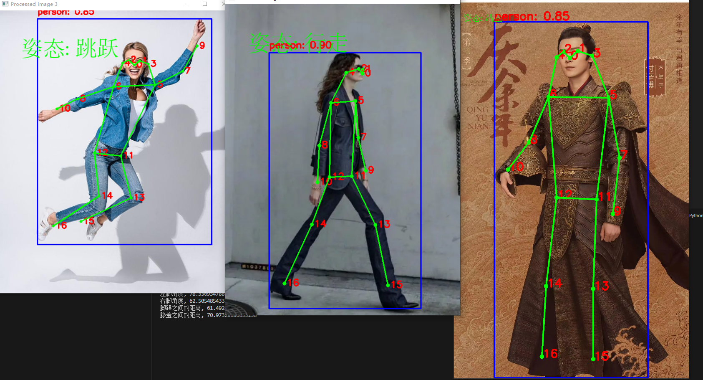

# YOLOv8 人体姿态判断

## 项目介绍

YOLOv8 人体姿态判断是一个基于最新YOLOv8模型的深度学习项目，旨在识别和分析人体姿态。此项目通过摄像头捕捉实时图像或处理存储图像，识别人体关键点，并根据这些关键点判断人体的姿态状态，如站立、行走或跳跃。

## 特性

- **实时姿态检测**：使用摄像头实时捕捉并分析人体姿态。
- **高精度识别**：利用YOLOv8模型高效识别图像中的人体和关键点。
- **多姿态判断**：能够判断多种人体姿态，包括但不限于站立、行走和跳跃。
- **易于集成**：提供了简单的API，便于在其他项目中集成和使用。

## 开始使用

### 先决条件

确保你的机器上已安装以下软件：
- Python 3.8+
- PyTorch 1.7+
- OpenCV 4.5+
- Numpy

### 安装

首先克隆这个仓库到本地：

```bash
git clone git@github.com:Mrjianning/yolov8_pose_judge.git
cd yolov8_pose_judge
```

安装所需的依赖：

```bash
pip install -r requirements.txt
```

### 快速开始

运行以下命令以启动姿态检测：

```bash
python main.py 
```


## 示例

以下是一些使用YOLOv8 人体姿态判断进行姿态检测的示例图片：




